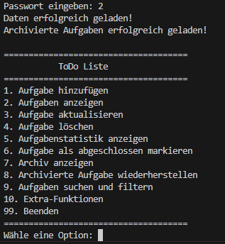
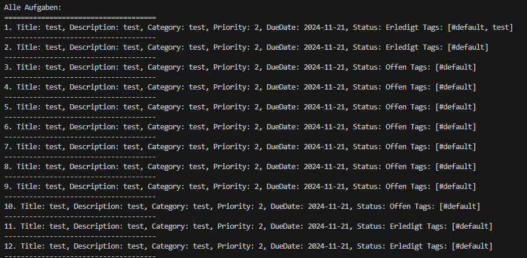
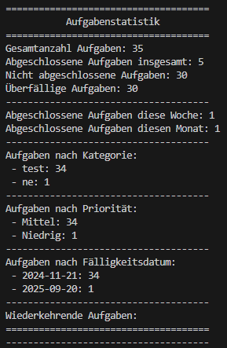

# Todo List Console

A console based task manager with password protected access, recurring task helpers, and CSV import and export. The user interface runs in German because this matched the requirement of the course.

## Project Overview
- Built as a small university assignment; no further development is planned.
- Written in Java 17 and managed with Maven.
- Persists data to plain text files so that tasks survive application restarts.

## Features
- Add, update, delete, archive, and restore tasks through an interactive menu.
- Track metadata such as category, priority, due date, completion state, recurrence type, and free form tags.
- Generate simple statistics for due dates, categories, priorities, and recurring tasks.
- Import and export the task list as CSV for backup or migration.
- Maintain an activity log in `todo-log.txt` for auditing actions taken in the console.

## Screenshots




## Getting Started

### Prerequisites
- Java Development Kit 17
- Maven 3.9 or newer

### Build
```bash
mvn clean install
```

### Run
```bash
mvn exec:java
```

## Usage Tips
- The application prompts for a password on startup. The current value is stored in `password.txt` (the repository ships with `2`).
- After authentication the main menu lists numbered actions. Enter the matching number and press Enter to navigate.
- Extra functions allow you to change the password, reload or persist all tasks, and import or export CSV files.
- Task data is kept in `todo-data.txt`; archived entries live in `archive-data.txt`. Delete these files if you want to reset the storage.

## Project Status
This repository documents the submission that satisfied the assignment requirements. It is preserved as is and will not receive additional updates or support.
